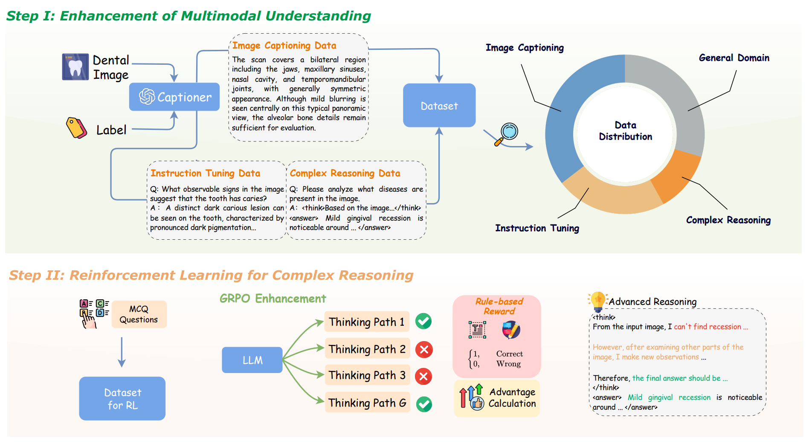
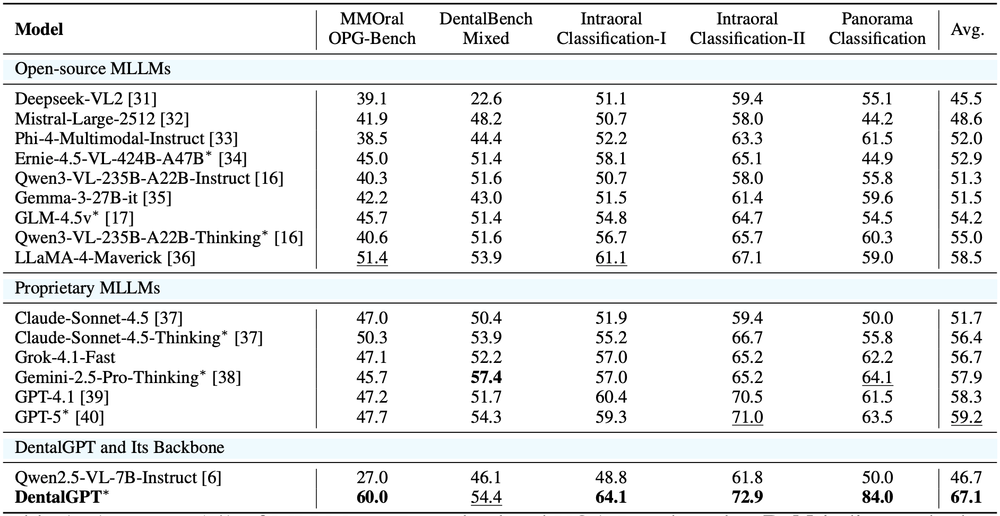

# DentalGPT: Incentivizing Multimodal Complex Reasoning in Dentistry

<div align="center">
<h3>
  DentalGPT
</h3>
</div>

## ⚡ Introduction
Hello! Welcome to the repository for DentalGPT! **DentalGPT** is the first specialized dental Multimodal Large Language Model (MLLM) equipped with **advanced complex reasoning capabilities**. While general MLLMs struggle to capture fine-grained dental visual details, DentalGPT leverages high-quality domain knowledge injection and reinforcement learning to interpret complex reasoning in dentistry.

Despite its compact **7B parameter** scale, DentalGPT achieves superior performance in disease classification and dental VQA tasks, outperforming many state-of-the-art models with over 100B parameters (such as GPT-5 and Gemini-2.5-Pro).

### Key Contributions:
* **Massive Scale**: Constructed the largest annotated dental multimodal dataset to date with **over 120k dental images**.
* **2-Stage Training**: A novel pipeline involving **Multimodal Understanding Enhancement** and **Reinforcement Learning (RL)**.
* **Advanced Reasoning**: Integration of the **Group Relative Policy Optimization (GRPO)** algorithm to incentivize long chain-of-thought (CoT) reasoning for precise diagnosis in dentistry.

## 👨‍⚕️ Model Training Pipeline

**DentalGPT** is developed on top of the **Qwen2.5-VL-7B-Instruct** backbone through a structured 2-stage process:

### Stage I: Multimodal Understanding Enhancement
This stage focuses on injecting high-quality dental domain knowledge:
* **Image Captioning**: Alignment of visual features with professional dental terminology.
* **Instruction Tuning**: Enhancing performance on downstream tasks through expert-verified QA pairs.
* **Knowledge Density**: Training on data with higher knowledge density and professional quality compared to standard GPT-distilled datasets.

### Stage II: Reinforcement Learning for Complex Reasoning
We apply the **Group Relative Policy Optimization (GRPO)** algorithm to strengthen diagnostic logic:
* **Thinking Mode**: The model is trained to use `<think>` tags for internal reasoning and reflection before providing a final `<answer>`.
* **Iterative Refinement**: Encourages the model to self-correct intermediate counting or identification errors, leading to higher accuracy in complex dental tasks.

<div align=center>

</div>

## 🧐 Evaluation

<details close>
<summary><h4>Evaluation Settings</h></summary>

#### Evaluation Data Collection
To evaluate the capability of multimodal large language models (MLLMs) in understanding dental images, we curated a specialized evaluation dataset sourced from hospital and internet data.

To ensure clinical reliability, we evaluated the model on five specialized datasets:
1.  **MMOral-OPG-Bench**: A benchmark assessing panoramic X-ray understanding across five clinically grounded dimensions.
2.  **DentalBench-Mixed**: A targeted dataset formed by filtering tooth-related images from widely used medical VQA benchmarks (PMC-VQA, OmniMedVQA, MedXpertQA-MM).
3. **Intraoral-Classification-I**
- A collection of intraoral photographs from the [AlphaDent](https://www.kaggle.com/competitions/alpha-dent) dataset, captured by licensed dentists from a clinical perspective under standardized lighting and imaging conditions.
- These images provide high-quality professional references of oral health conditions.
- Included labels: *Tooth discoloration, Abnormal gingival coloration, Gingival recession, Dental caries, Tooth pigmentation, Tooth defect or loss, Tooth loss, Dental calculus, Abnormal tooth morphology, Abnormal gingival morphology.*
4. **Intraoral-Classification-II**
- A set of intraoral images collected from the internet based on dental-related keywords.
– The images feature diverse lighting and shooting angles, simulating photos that patients might take themselves.
- Included labels: *Tooth pigmentation, Abnormal gingival coloration, Dental calculus, Tooth loss, Dental caries, Abnormal gingival morphology, Gingival recession.*
5. **Panorama-Classification**
- A dataset of panoramic dental radiographs (X-rays) provided by Shenzhen Stomatology Hospital (Pingshan) of Southern Medical University, containing real patient panoramic imaging data.
- Included labels: *Periodontal disease, Root canal treatment, Tooth defect or loss, Jawbone lesion, Periapical lesion, Impacted tooth.*
Together, these subsets cover both clinical and in-the-wild dental imaging conditions, ensuring a comprehensive evaluation of the models’ visual diagnostic abilities.
</details>

#### Evaluation Results

<div align=center>

</div>

DentalGPT demonstrates superior performance across all evaluated benchmarks, establishing it as a leading multimodal foundation model for dental image understanding.

1. **Expert-Level Performance with 7B Efficiency**: Despite its compact size, DentalGPT consistently outperforms general-purpose models with over larger parameters (such as GPT-5 and Gemini-2.5-Pro) in dental-specific tasks. This highlights the effectiveness of domain-specialized training.
2. **Robust Generalization**: The model achieves significant gains across diverse modalities, including professional panoramic X-rays and "in-the-wild" intraoral photos taken by patients. It shows a massive improvement over its backbone model, particularly in identifying complex conditions like periapical lesions and impacted teeth.

##  📖 About Us
We are from:
- The Chinese University of Hong Kong, Shenzhen 香港中文大学（深圳）
- Shenzhen Stomatology Hospital (Pingshan) of Southern Medical University 南方医科大学深圳口腔医院（坪山）
- Faculty of Dentistry, The University of Hong Kong 香港大学牙医学院
- Freedom AI 深圳自由动脉科技有限公司

特别鸣谢智谱华章科技提供支持。

## 📖 Citation
```
@inproceedings{cai2026dentalgpt,
  title={DentalGPT: Incentivizing Multimodal Reasoning in Dentistry},
  author={Cai, Zhenyang and Zhang, Jiaming and Zhao, Junjie and Zeng, Ziyi and Li, Yanchao and Jingyi, Liang and Chen, Junying and Yang, Yunjin and You, Jiajun and Deng, Shuzhi and others},
  booktitle={Findings of the Association for Computational Linguistics: ACL 2026},
  pages={2811--2829},
  year={2026}
}
```
